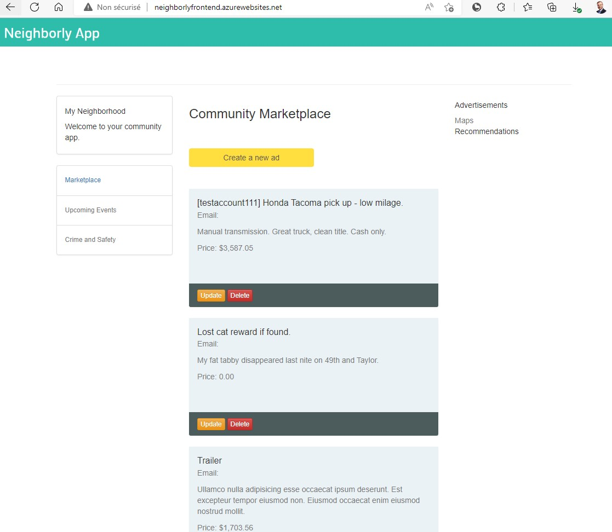
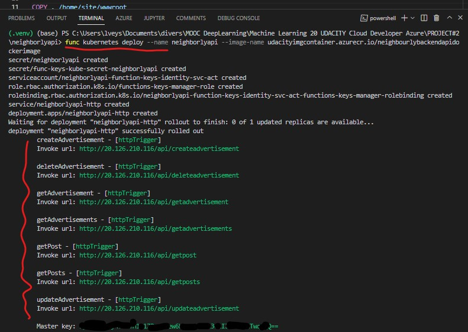
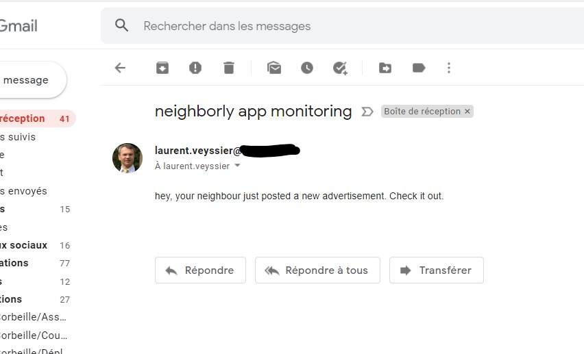
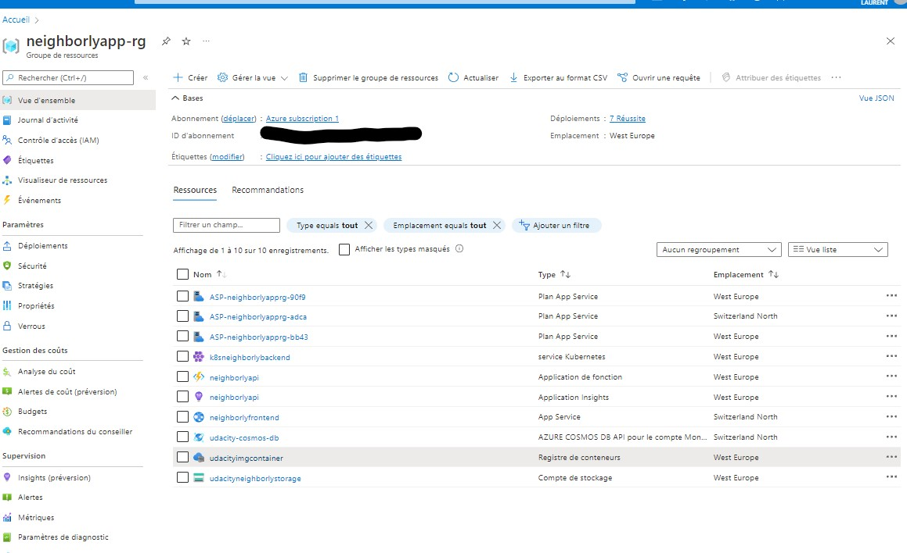

# Udacity project - Azure Serverless Application with back-end Functions and Flask Webapp Front-end

This project is part of Udacity Cloud Developer on Azure Nanodegree. It can be found [here](https://github.com/udacity/nd081-c2-Building-and-deploying-cloud-native-applications-from-scratch-project-starter)

It summarizes the third module dedicated to Azure Microservices. In this module, we cover Serverless functions (FunctionApps, WebApps,...), Logic Apps and Event Grid / Hub as well as Deployment (serverless, containerization with Docker and deployment to Kubernetes) plus security features. There are lots of hand-on practice culminating with this final project.

The purpose of the project is to deploy a Flask web application hosting both ads and posts. The app operates CRUD capabilities (Create, Read, Update, Delete) using a CosmosDB database and azure functions in the back-end. From this serverless architecture, the back-end functions are containerized and deployed to a Kubernetes cluster as an alternative.

Implemented Azure ressources in the project:
- Cosmos DB
- FunctionApp (http triggered functions)
- Webapp
- EventHub
- LogicApp with SendGrid
- Azure Container Registry for Docker images
- Kubernetes deployment

All these tools provide strong backbone for my applications. I find them extremely powerfull to deploy ML/data apps and services at scale in a very orchestrated manner.

# Output

- Front-end webapp

- back-end live on Kubernetes cluster

- LogicApp triggered notice using SendGrid email service

- Some of the implemented resources

